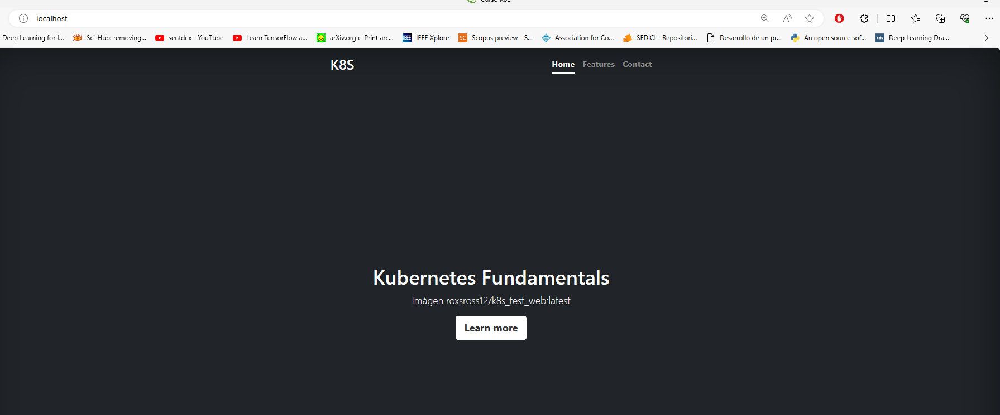

Web App Deployment usando minikube

El equipo de desarrollo de la empresa esta trabajando en una nueva aplicacion web. 
Una primera version del mismo ha sido subida a DockerHub y vamos a desplegarla en Kubernetes

Vamos a desplegar esta primera versión de la aplicación, para ello:

Creamos todos los microservicios necesarios para la misma 
    1. namespace
    2. Service
    3. PersistentVolume
    4. PersistentVolumeClaim
    5. Deployment

Crea una redirección utilizando el port-forward para acceder a la aplicación, sabiendo que la aplicación ofrece el servicio en el puerto 80, y accede a la aplicación con un navegador web.

------------------------------------------------------------------------------------
Web App Deployment using minikube

The development team is working on a new web application. A first version of the same has been deployed to DockerHub and we are going to deploy it to kubernetes.

Lets deply a first version of this app

For this, we need to create all the necesary microservices.
    1. namespace
    2. Service
    3. PersistentVolume
    4. PersistentVolumeClaim
    5. Deployment

We use a redirection using port-forward in order to access to the application, knowing that the app offers service on port 80.